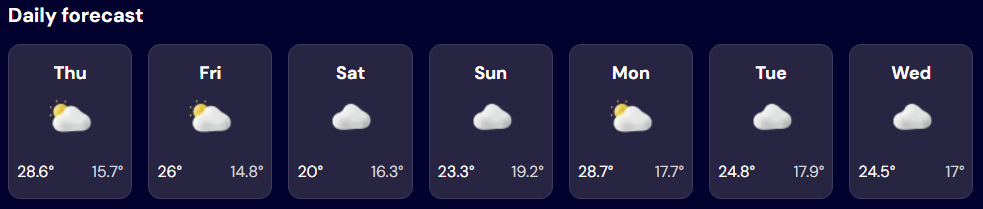

# Frontend Mentor - Weather app solution

This is a solution to the [Weather app challenge on Frontend Mentor](https://www.frontendmentor.io/challenges/weather-app-K1FhddVm49).

## Table of contents

- [Overview](#overview)
  - [The challenge](#the-challenge)
  - [Screenshots](#screenshot)
  - [Links](#links)
- [My process](#my-process)
  - [Built with](#built-with)
- [Author](#author)

**Note: Delete this note and update the table of contents based on what sections you keep.**

## Overview

### The challenge

Users should be able to:

- Search for weather information by entering a location in the search bar
- View current weather conditions including temperature, weather icon, and location details
- See additional weather metrics like "feels like" temperature, humidity percentage, wind speed, and precipitation amounts
- Browse a 7-day weather forecast with daily high/low temperatures and weather icons
- View an hourly forecast showing temperature changes throughout the day
- Switch between different days of the week using the day selector in the hourly forecast section
- Toggle between Imperial and Metric measurement units via the units dropdown
- Switch between specific temperature units (Celsius and Fahrenheit) and measurement units for wind speed (km/h and mph) and precipitation (millimeters) via the units dropdown
- View the optimal layout for the interface depending on their device's screen size
- See hover and focus states for all interactive elements on the page

### Screenshots

- Search for weather information by entering a location in the search bar
  

- If the searched location is invalid, show no results
  

- If any error occurs during data fetching, show error message
  

- If the searched location is valid, show loading state while fetching data
  

- View current weather conditions including:

  1. temperature, weather icon, and location details
  2. weather metrics like "feels like" temperature, humidity percentage, wind speed, and precipitation amounts

  

- Browse a 7-day weather forecast with daily high/low temperatures and weather icons
  

- View an hourly forecast showing temperature changes throughout the day
  

- Switch between different days of the week using the day selector in the hourly forecast section
  

- Toggle between Imperial and Metric measurement units via the units dropdown

  

- Switch between specific temperature units (Celsius and Fahrenheit) and measurement units for wind speed (km/h and mph) and precipitation (millimeters) via the units dropdown

  1. Metric Units (default)
     

  2. Imperial Units
     

- View the optimal layout for the interface depending on their device's screen size

  1. Mobile layout
     

  2. Desktop layout
     

- See hover and focus states for all interactive elements on the page

  1. Search Button
     

  2. Retry Button
     

  3. Metric/Imperial Toggle

     

  4. Hourly Day forecast Toggle

     

### Links

- Solution URL: [https://github.com/f29pereira/weather-app](https://github.com/f29pereira/weather-app)
- Live Site URL: [f29pereira.github.io/weather-app/](f29pereira.github.io/weather-app/)

## My process

### Built with

- Semantic HTML5 markup
- CSS custom properties
- Flexbox
- CSS Grid
- Mobile-first workflow
- [React](https://reactjs.org/) - JS library
- [Next.js](https://nextjs.org/) - React framework

## Author

- Frontend Mentor - [@f29pereira](https://www.frontendmentor.io/profile/f29pereira)
